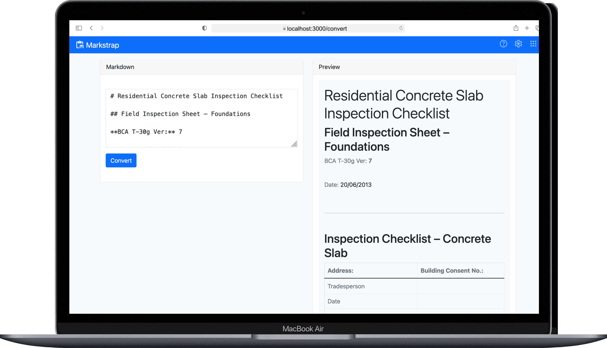

# Markstrap
Markstrap is a lightweight, single-page application built with Express and Bootstrap that converts Markdown input into Bootstrap-styled HTML.



## Features

- **Markdown to HTML Conversion**: Converts Markdown text into Bootstrap-styled HTML.
- **Bootstrap Integration**: Automatically applies Bootstrap classes to headings, lists, tables, and more.
- **Live Preview**: Displays the converted HTML output in real-time within a responsive Bootstrap container.
- **Clean & Minimalist Design**: Uses Bootstrap's styling for a user-friendly interface.


## Getting Started

### Prerequisites

- **Node.js** (>= 14.0)
- **npm** (comes with Node.js)

### Installation

1. **Clone the repository**:
```bash
   git clone https://github.com/steven2k2/markstrap.git
   cd markstrap
   npm install
   npm start
```


## License

This is free and unencumbered software released into the public domain.

Anyone is free to copy, modify, publish, use, compile, sell, or distribute this software, either in source code form or as a compiled binary, for any purpose, commercial or non-commercial, and by any means.

In jurisdictions that recognize copyright laws, the author or authors of this software dedicate any and all copyright interest in the software to the public domain. We make this dedication for the benefit of the public at large and to the detriment of our heirs and successors. We intend this dedication to be an overt act of relinquishment in perpetuity of all present and future rights to this software under copyright law.

THE SOFTWARE IS PROVIDED “AS IS”, WITHOUT WARRANTY OF ANY KIND, EXPRESS OR IMPLIED, INCLUDING BUT NOT LIMITED TO THE WARRANTIES OF MERCHANTABILITY, FITNESS FOR A PARTICULAR PURPOSE AND NONINFRINGEMENT. IN NO EVENT SHALL THE AUTHORS BE LIABLE FOR ANY CLAIM, DAMAGES OR OTHER LIABILITY, WHETHER IN AN ACTION OF CONTRACT, TORT OR OTHERWISE, ARISING FROM, OUT OF OR IN CONNECTION WITH THE SOFTWARE OR THE USE OR OTHER DEALINGS IN THE SOFTWARE.

